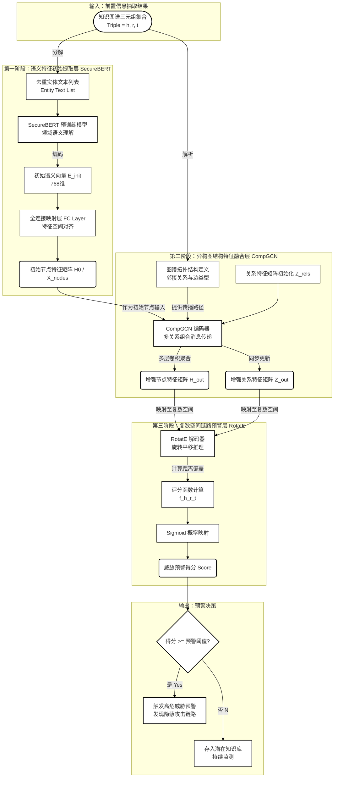

# Exercise
czz...

## 知识图谱威胁预警系统流程图

```mermaid
graph TD
    %% 定义黑白样式
    classDef bwFill fill:#ffffff,stroke:#000000,stroke-width:1px;
    classDef bwBold fill:#ffffff,stroke:#000000,stroke-width:2px;

    %% --- 输入阶段 ---
    subgraph Input_Stage [输入：前置信息抽取结果]
        A([知识图谱三元组集合<br>Triple = h, r, t]):::bwBold
    end

    %% 数据分流处理
    A --分解--> B1[去重实体文本列表<br>Entity Text List]:::bwFill
    A --解析--> B2[图谱拓扑结构定义<br>邻接关系与边类型]:::bwFill

    %% --- 第一阶段：语义特征注入 ---
    subgraph Stage1 [第一阶段：语义特征初始提取层 SecureBERT]
        B1 --> C1[SecureBERT 预训练模型<br>领域语义理解]:::bwBold
        C1 --编码--> C2[初始语义向量 E_init<br>768维]:::bwFill
        C2 --> C3[全连接映射层 FC Layer<br>特征空间对齐]:::bwFill
        C3 --> C4(初始节点特征矩阵 H0 / X_nodes):::bwBold
    end

    %% --- 第二阶段：结构特征融合 ---
    subgraph Stage2 [第二阶段：异构图结构特征融合层 CompGCN]
        D0[关系特征矩阵初始化 Z_rels]:::bwFill --> D1[CompGCN 编码器<br>多关系组合消息传递]:::bwBold
        C4 --作为初始节点输入--> D1
        B2 --提供传播路径--> D1
        D1 --多层卷积聚合--> D2(增强节点特征矩阵 H_out):::bwBold
        D1 --同步更新--> D3(增强关系特征矩阵 Z_out):::bwBold
    end

    %% --- 第三阶段：链路预测推理 ---
    subgraph Stage3 [第三阶段：复数空间链路预警层 RotatE]
        D2 --映射至复数空间--> E1[RotatE 解码器<br>旋转平移推理]:::bwBold
        D3 --映射至复数空间--> E1
        E1 --计算距离偏差--> E2[评分函数计算<br>f_h_r_t]:::bwFill
        E2 --> E3[Sigmoid 概率映射]:::bwFill
        E3 --> E4(威胁预警得分 Score):::bwBold
    end

    %% --- 输出决策 ---
    subgraph Output_Stage [输出：预警决策]
        E4 --> F{得分 >= 预警阈值?}:::bwBold
        F --是 Yes--> G[触发高危威胁预警<br>发现隐蔽攻击链路]:::bwBold
        F --否 No--> H[存入潜在知识库<br>持续监测]:::bwFill
    end

    %% 整体流向线条增强（黑白）
    linkStyle default stroke-width:1px,fill:none,stroke:black;
```
